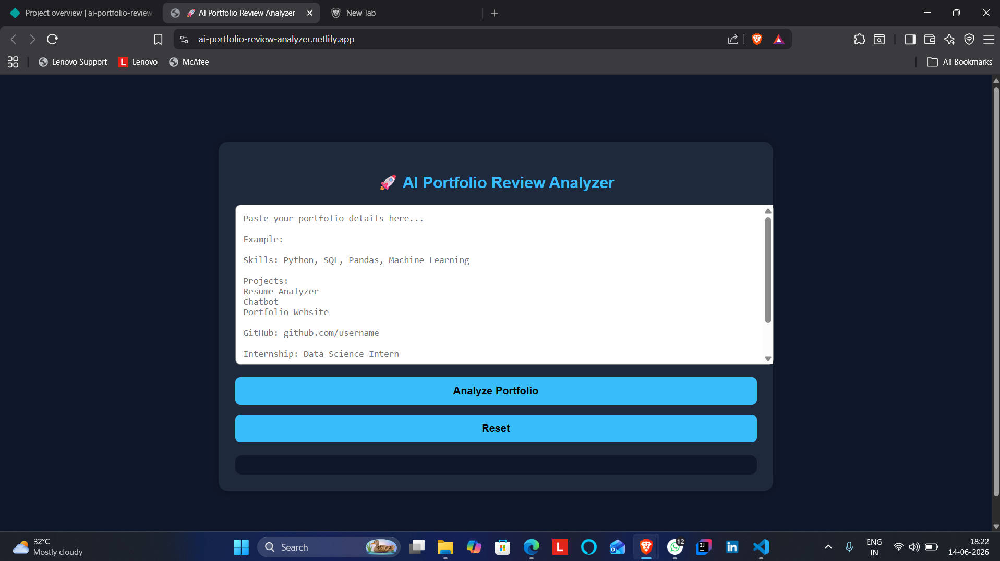
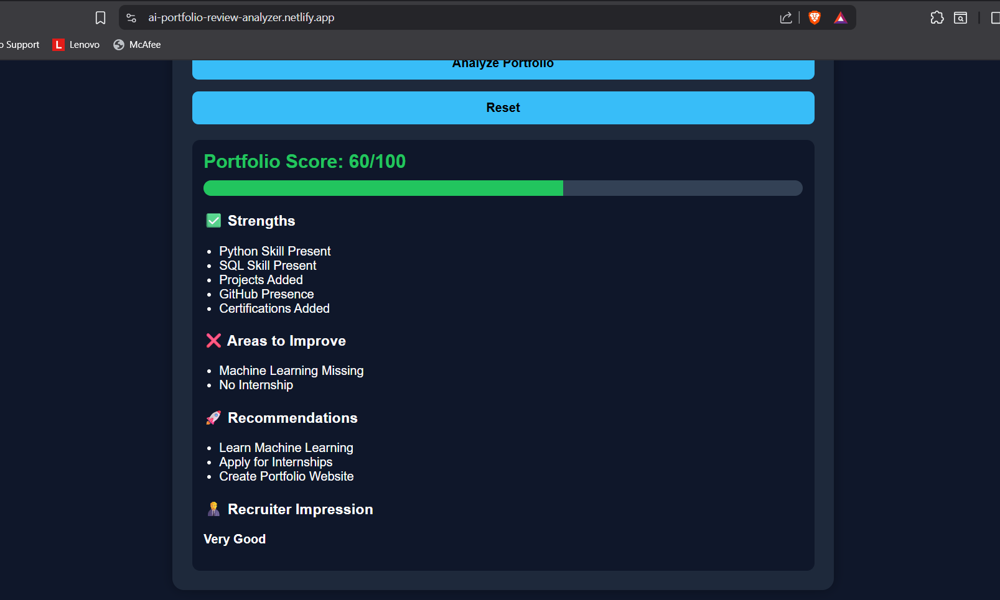

# AI Portfolio Review Analyzer

🚀 Day 6 of my 30 Days 30 AI Websites Challenge

AI Portfolio Review Analyzer is a web application that evaluates portfolio details and provides a portfolio score, strengths, weaknesses, recommendations, and recruiter impression.

---

## 🌐 Live Demo

https://ai-portfolio-review-analyzer.netlify.app/

---

## 📸 Screenshot

---

## ✨ Features

- Portfolio Score Calculation
- Strength Detection
- Weakness Detection
- Improvement Recommendations
- Recruiter Impression Analysis
- Responsive UI
- AI-Assisted Development

---

## 🎯 Evaluation Areas

- Python Skills
- SQL Skills
- Machine Learning Skills
- Projects
- GitHub Presence
- Internship Experience
- Certifications
- Portfolio Website

---

## 🛠 Technologies Used

- HTML
- CSS
- JavaScript
- Built with the help of AI-assisted development tools
---

## 📋 How It Works

1. Paste portfolio details.
2. Click Analyze Portfolio.
3. View:
   - Portfolio Score
   - Strengths
   - Weaknesses
   - Recommendations
   - Recruiter Impression

---

## 🚀 Example

Portfolio Score:
100/100

Strengths:
- Python Skill Present
- SQL Skill Present
- Projects Added
- GitHub Presence
- Internship Experience

Recruiter Impression:
Excellent

---

## 🎯 Challenge

This project is part of my 30 Days 30 AI Websites Challenge where I build and publish one AI-assisted website every day.

### Progress

- Day 1 ✅ AI Resume Analyzer
- Day 2 ✅ AI Career Roadmap Generator
- Day 3 ✅ AI Project Idea Generator
- Day 4 ✅ AI Skill Gap Analyzer
- Day 5 ✅ AI Interview Question Generator
- Day 6 ✅ AI Portfolio Review Analyzer

---

## 👨‍💻 Author

Anand,

B.Tech CSE(Data Science)
